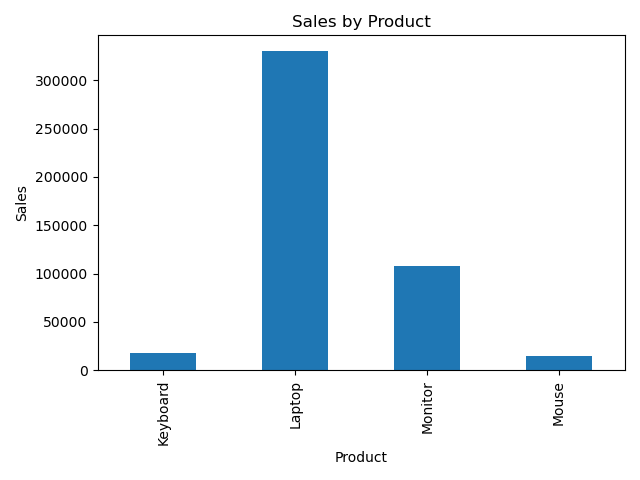

# Python Data Analysis

A beginner-friendly Python project for analyzing sales data using Pandas and Matplotlib.

## What this project does

- Calculates total sales
- Finds the best-selling product
- Calculates average sales
- Counts the number of records
- Creates a sales visualization

## Technologies

- Python
- Pandas
- Matplotlib

## How to Run

1. Clone this repository.
2. Install the required libraries:
   `pip install -r requirements.txt`
3. Run the analysis:
   `python analysis.py`

## Results

The analysis identifies the best-selling product and provides sales statistics and a bar chart for product-wise sales.

### Best-selling Product
Laptop

### Visualization

